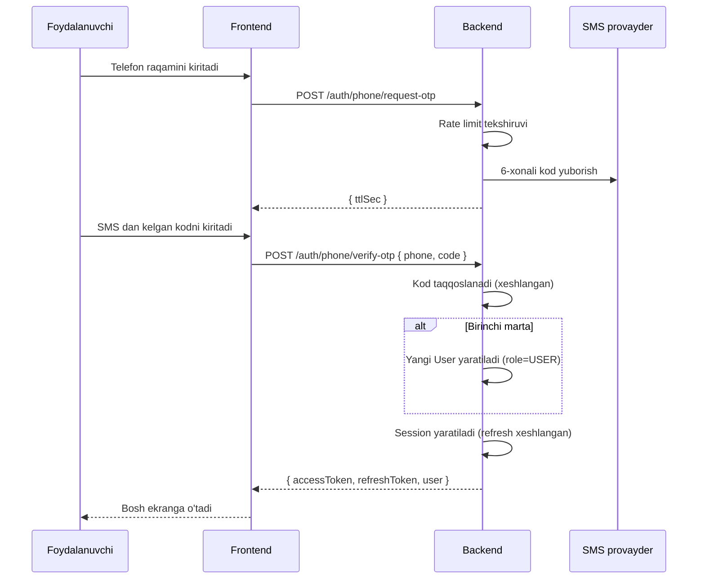
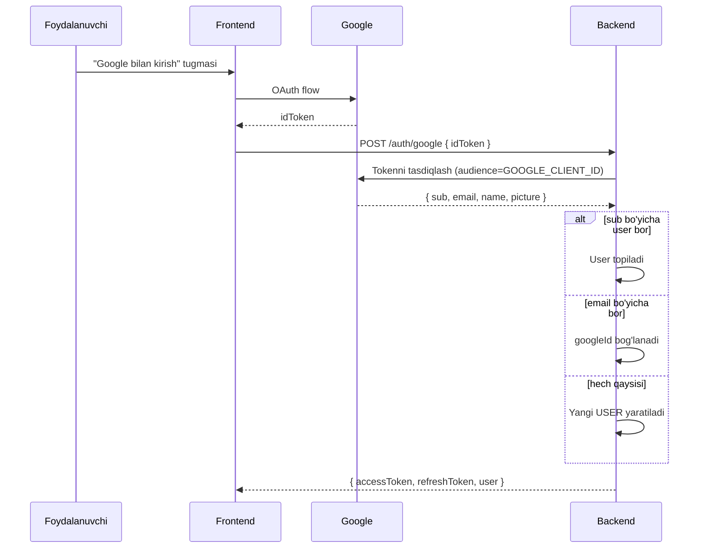
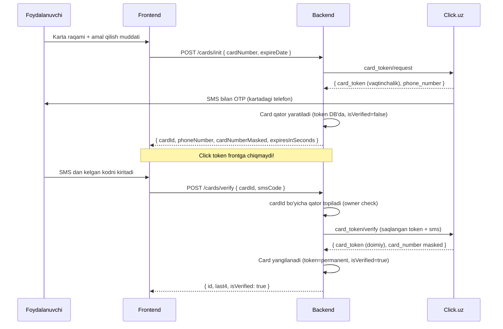
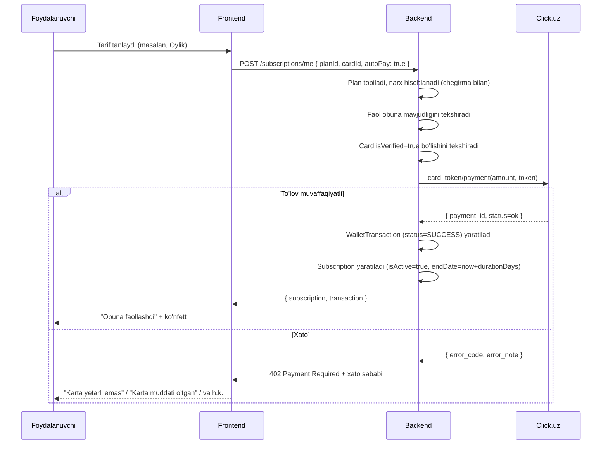
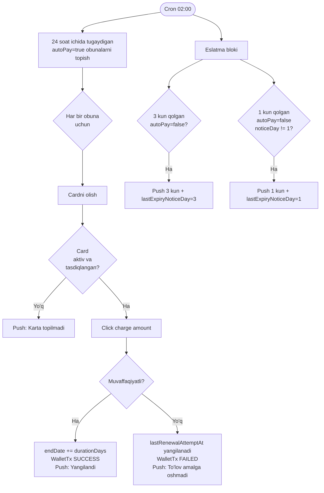
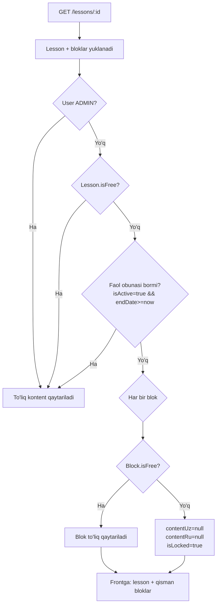
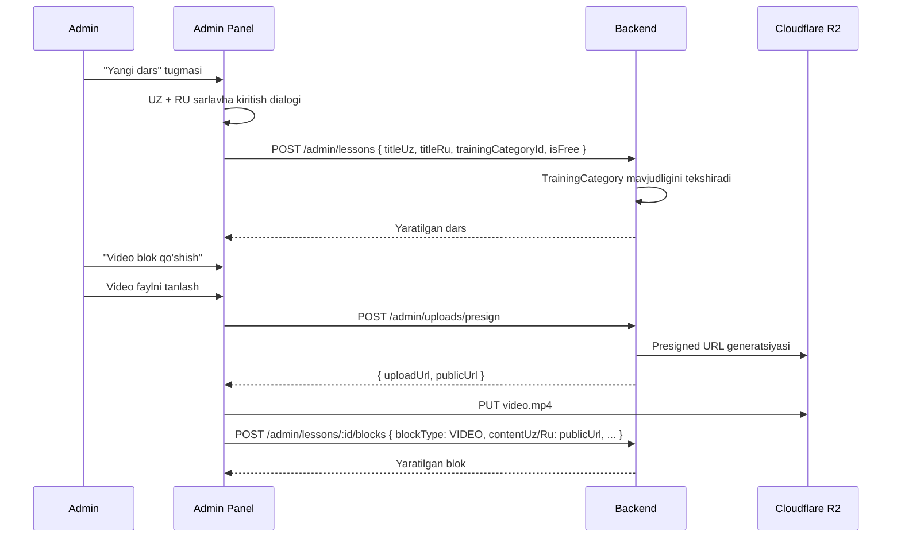
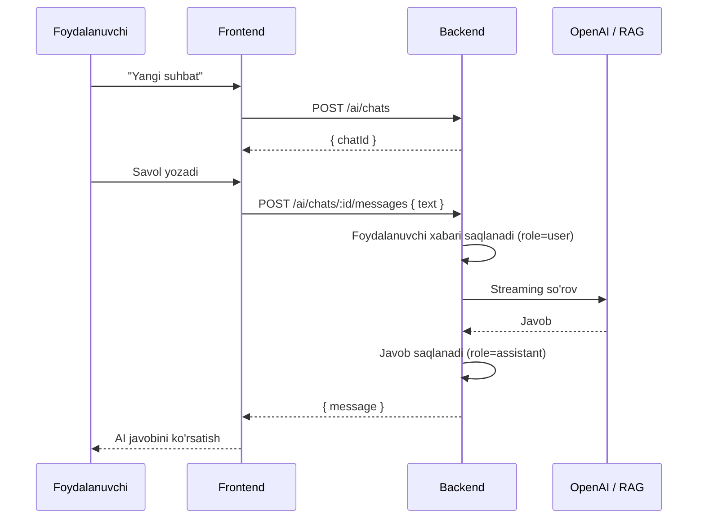
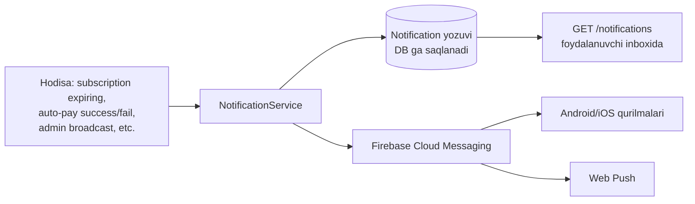
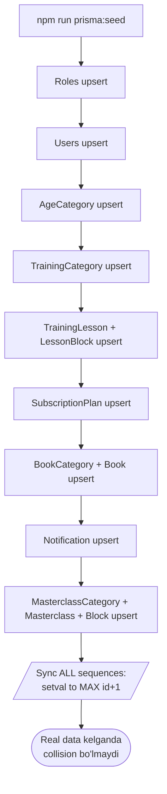

# Foydalanuvchi va Tizim Oqimlari

> Mermaid sequence/flow diagrammalar. Miro AI yoki ChatGPT'ga shu hujjatni yuklab, "ushbu oqimlar uchun visual sequence diagram chizib ber" so'rovini bering.

---

## 1. Telefon OTP orqali kirish

---

## 2. Google bilan kirish (USER)

---

## 3. Karta qo'shish (Click 2 bosqichli)

---

## 4. Obuna sotib olish

---

## 5. Avtomatik yangilanish (cron, har kuni 02:00)

---

## 6. Pullik kontentga kirish (paywall)

---

## 7. Admin panel kontent yaratish

---

## 8. AI chat suhbati

---

## 9. Push bildirishnomalar

---

## 10. Idempotent seed va sequence sync

